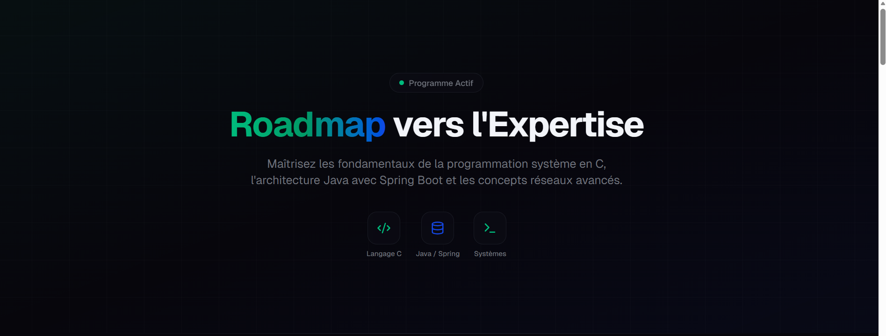
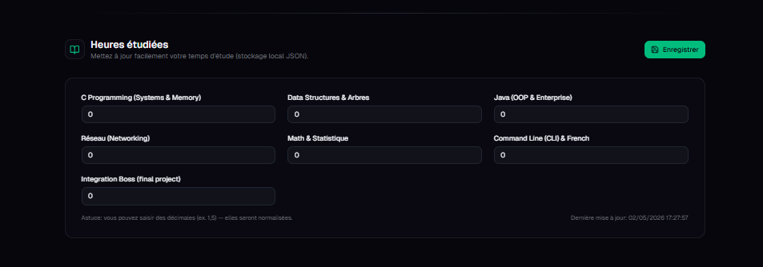
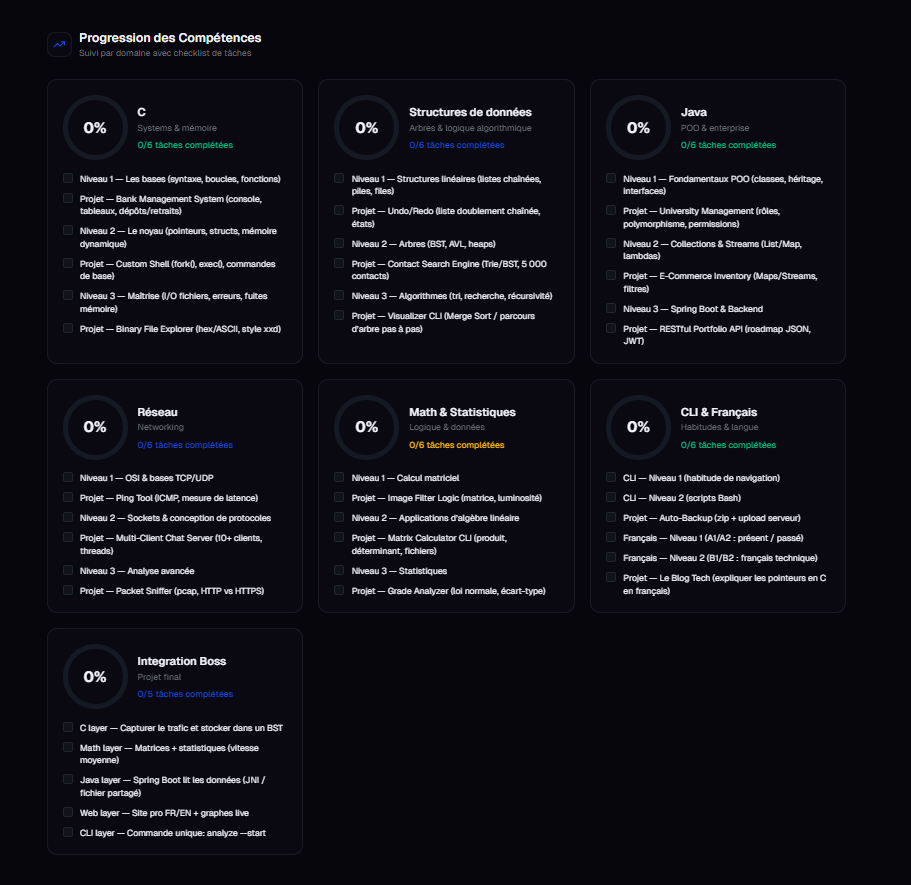
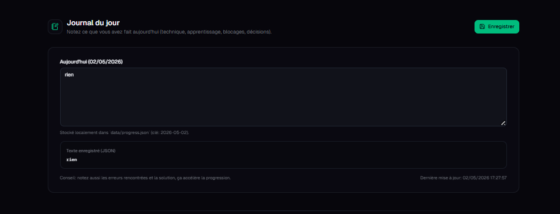
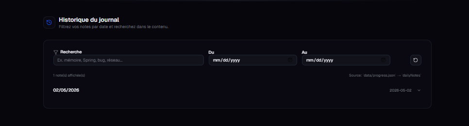
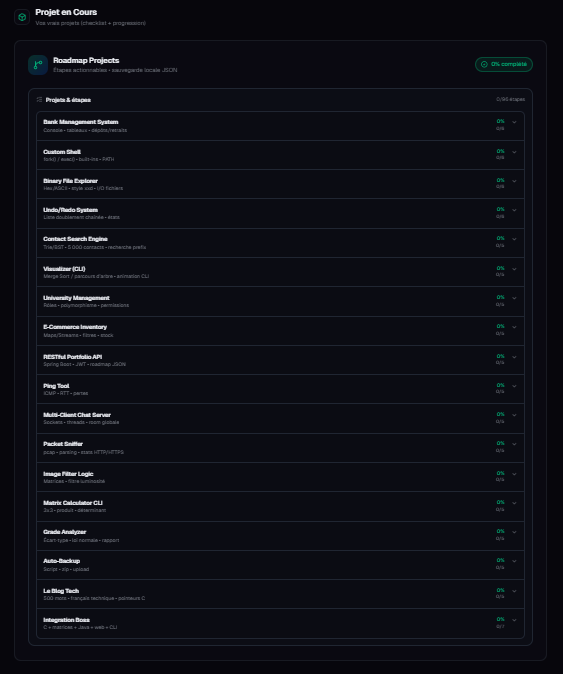
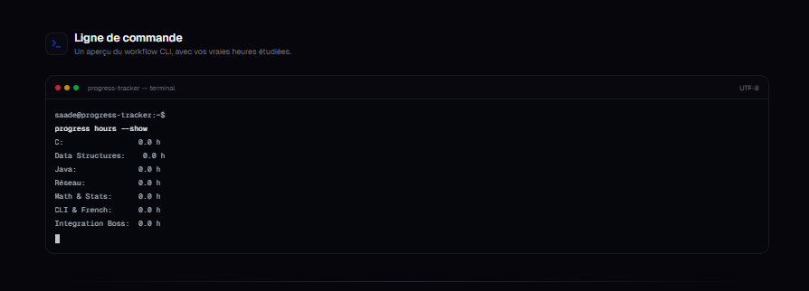
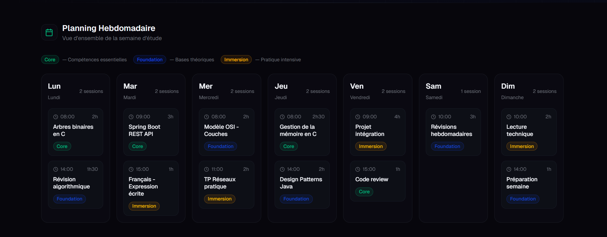

Ce projet est un **tableau de bord de suivi d'apprentissage personnel** pour développeur, construit avec Next.js 16 (App Router) et TypeScript.

 
---

## Vue d'ensemble

L'application s'appelle **"Roadmap vers l'Expertise"** et permet à un apprenant de suivre sa progression dans plusieurs domaines techniques en même temps. Toutes les données sont stockées localement dans un fichier `data/progress.json` sur le serveur, sans base de données externe.

---

## Stack technique

Next.js 16 avec App Router, React 19, TypeScript strict, Tailwind CSS v4, shadcn/ui (composants Radix UI), Zod pour la validation, et Recharts pour les graphiques. Le tout tourne en Node.js côté serveur pour la lecture/écriture de fichiers.

---

## Fonctionnalités principales

**Suivi des heures étudiées** — L'utilisateur saisit manuellement ses heures par domaine (C, Java, Réseau, Math, etc.) et les sauvegarde via un PATCH vers l'API. Les données sont fusionnées avec les valeurs existantes, jamais écrasées brutalement.

 

**Progression par compétences** — Chaque domaine (C, structures de données, Java, réseau, maths, CLI/français, projet intégration) dispose d'une checklist de tâches avec des cercles de progression SVG animés. Les coches sont sauvegardées en temps réel avec mise à jour optimiste et rollback en cas d'échec.

 
**Journal du jour** — Zone de texte libre associée à la date du jour au format `YYYY-MM-DD`. Le texte est persisté dans `dailyNotes` du JSON.

 
**Historique du journal** — Vue filtrée de toutes les notes passées, avec recherche full-text et filtre par plage de dates. Les entrées s'affichent dans un accordéon.

 
**Projets en cours** — Liste de 18 projets concrets (Bank Management System, Custom Shell, Spring Boot API, Packet Sniffer, etc.) chacun avec ses propres étapes cochables et une barre de progression. 

 
**Terminal CLI simulé** — Fenêtre de terminal stylée qui affiche les vraies heures étudiées fetchées depuis l'API.

 
**Planning hebdomadaire** — Grille des 7 jours avec sessions de type Core/Foundation/Immersion.

 
---

## Architecture backend

Un seul endpoint REST `/api/progress` gère tout : `GET` pour lire, `PUT` pour réécrire complètement, `PATCH` pour fusionner partiellement. Le fichier `lib/progress-storage.ts` encapsule toute la logique de lecture/écriture avec Zod pour valider le schéma, migration automatique si le fichier est absent ou corrompu, et merge intelligent des données par défaut.

---

## Design

Thème sombre permanent (slate-950), palette emerald + blue, effet glassmorphism sur les cartes, police Geist. Le dashboard est entièrement responsive avec grilles CSS adaptatives.
